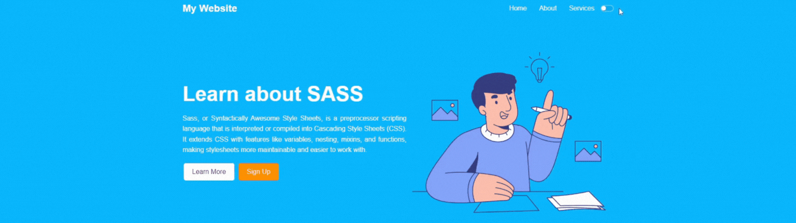

<div align="center">
  
</div>

<h1 align="center">Roadmap de estudos SYDLE</h1>

## Introdução
Este é um repositório de todos os estudos realizados durante a capacitação como desenvolvedor front-end. O objetivo é documentar o que foi aprendido e servir como guia para futuras consultas.

## Organização dos diretórios 
```bash
    └html_css
        └ conceitos basicos de html css
    └npm
        └ conceitos basicos de npm
    └react-js
        └ conceitos basicos de web components e react
    └sass
        └ conceitos basicos de sass
    └stencil
        └ conceitos basicos de stencil
    └typescript
        └ conceitos basicos de typescript
    └web-components
        └ conceitos basicos de web components
```

## Playlist de estudos
- [HTM: HTML Crash Course For Absolute Beginners](https://www.youtube.com/watch?v=UB1O30fR-EE)
- [CSS: CSS Crash Course For Absolute Beginners](https://www.youtube.com/watch?v=yfoY53QXEnI)
- [SASS: Sass Crash Course .](https://www.youtube.com/watch?v=nu5mdN2JIwM)
- [JavaScript: JavaScript Crash Course For Beginners](https://www.youtube.com/watch?v=hdI2bqOjy3c)
- [TypeScript: TypeScript Crash Course 2021](https://www.youtube.com/watch?v=BCg4U1FzODs)
- [NPM:  NPM Crash Course](https://www.youtube.com/watch?v=jHDhaSSKmB0)
- [Web Components Web Component Crash Course .](https://www.youtube.com/watch?v=PCWaFLy3VUo)
- [Stencil: O que são web components e como iniciar? - Custom elements e StencilJS](https://www.youtube.com/watch?v=ikmQpalJV0w)

## Para ir além
O Vídeo [SASS: Sass Crash Course](https://www.youtube.com/watch?v=nu5mdN2JIwM) apresenta uma interface no qual implementa-se um início de uma landing page, no qual cria uma função capaz de alterar a cor da letra dependendo do background. A partir disso, é possível criar um projeto de uma landing page com um design mais elaborado no qual podemos acrescentar a ideia de light e dark mode.



Para fazer isso precisamos fazer algumas pequenas alterações no código, como por exemplo, criar uma função que altere a cor do texto dependendo do background, criar algumas variáveis para as cores e criar um botão para alternar entre os modos. O seu arquivo `style.scss` deve ficar parecido com o exemplo abaixo: 

```scss
@import 'config'; 
*{
    box-sizing: border-box;
    margin: 0;
    padding: 0;
}

:root{
    --body-bg: #0eafff;
    --color: #fff;
}

.dark-mode:root{
    --body-bg: #121212;
    --color: #bb86fc;
}

body{
    background-color: $light-color;
    font-family: $font-stanck;
    line-height: 1.6;
}

img {
    width: 100%;
}

a{
    text-decoration: none;
}

.showcase{
    //@include set-background(var(--body-bg));
    background-color: var(--body-bg);
    color: var(--color);
    height: 600px;

    nav{
        display: flex;
        align-items: center;
        justify-content: space-between;

        ul{
            display: flex;
            list-style-type: none;
        }

        li{
            padding: 15px;
        }
        label{
            display: flex;
            align-items: center;
            justify-content: space-between;
        }

        a{
            color: set-text-color($primary-color);
        }

        a:hover{
            color: $secondary-color;
        }
    }

    //mesma coisa que dizer .showcase.content
    &-content{
        height: 100%;
        display: flex;
        align-items: center;
        justify-content: center;
        margin-top: 20px;

        img{
            width: 50%;
        }

        h1{
            font-size: 50px;
            line-height: 1.2;
        }
        p{
            text-align: justify;
        }
    }
}

.toggle{
  
    .toggle-control{
      transition: $transition;
       width: $width;
       height: $height;
       display: block;
      border: 2px solid $color_checkbox_default;
      border-radius: $height;
      background-color: rgba(black,.06);
      position: relative;
      &:after{
        transition: $transition;
        content: "";
        width: $width/2.8;
        height: $height/1.4;
        display: block;
        background-color: #fff;
        border-radius: 50%;
        box-shadow: 0 1px 2px rgba(black, .1),0 3px 2px rgba(#ff8800,.2);
        position: absolute;
        top: 0;
        left: 0;
      }
    }
    
   input{
        display: none;
        &:checked + .toggle-control{
            border-color: $secondary-color;
            background-color: $secondary-color;
            &:after{
                left: $width/2;
            }
        }
    } 
}

@import 'utilities'; 
@import 'buttons'; 
@import 'mobile';
```
Também precisamos adicionar um EventListener para o botão que irá alternar entre os modos. Para isso utilizamos um pouco de JavaScript. O arquivo `script.js` deve ficar parecido com o exemplo abaixo:

```javascript
const $html = document.querySelector('html');
const $checkbox = document.querySelector('#switch');

$checkbox.addEventListener('change', function(){
    $html.classList.toggle('dark-mode')
})`
```
> Não se esqueça de adicionar o arquivo `script.js` no seu arquivo `index.html` e de adicionar o input do tipo checkbox no seu arquivo `index.html` para que o botão funcione.

Agora precisamos criar o botão que irá alternar entre os modos. O seu arquivo `index.html` deve ficar parecido com o exemplo abaixo:
```html
<!DOCTYPE html>
<html lang="en">
<head>
    <meta charset="UTF-8">
    <meta name="viewport" content="width=device-width, initial-scale=1.0">
    <title>Sass Crash Course</title>
    <link rel="stylesheet" href="css/style.css"/>
    
</head>
<body>
    <header class="showcase">
        <div class="container">
            <nav>
                <h1 class="logo">My Website</h1>
                <ul>
                    <li><a href="#">Home</a></li>
                    <li><a href="#">About</a></li>
                    <li><a href="#">Services</a></li>
                    <label class="label toggle">
                        <input type="checkbox" class="toggle_input"  id="switch"/>
                        <div class="toggle-control"></div>
                    </label>
                </ul>
            </nav>

            <div class="showcase-content">
                <div>
                    <h1>Learn about SASS</h1>
                    <p class="my-1">
                        Sass, or Syntactically Awesome Style Sheets, is a preprocessor scripting language that is interpreted or compiled into Cascading Style Sheets (CSS). It extends CSS with features like variables, nesting, mixins, and functions, making stylesheets more maintainable and easier to work with.
                    </p>
                    <a href="#" class="btn-primary">Learn More</a>
                    <a href="#" class="btn-secondary">Sign Up</a>
                </div>
                
            </div>
        </div>
    </header>
    <script src="js/script.js"></script>
</body>
</html>
```

Agora você tem um projeto com um design mais elaborado e com a possibilidade de alternar entre os modos light e dark. Este é **apenas um exemplo** de várias formas possíveis de implementar o light e dark mode em um projeto.

### Referências
- [Botão toggle](https://codepen.io/Bradley_Lancaster/pen/jPzEbz)
- [Dark Mode com CSS: Simples, Rápido e Fácil](https://www.youtube.com/watch?v=rnkdLX6mOD4&t=404s&ab_channel=dpw)
- [Pasta do projeto](./sass/)